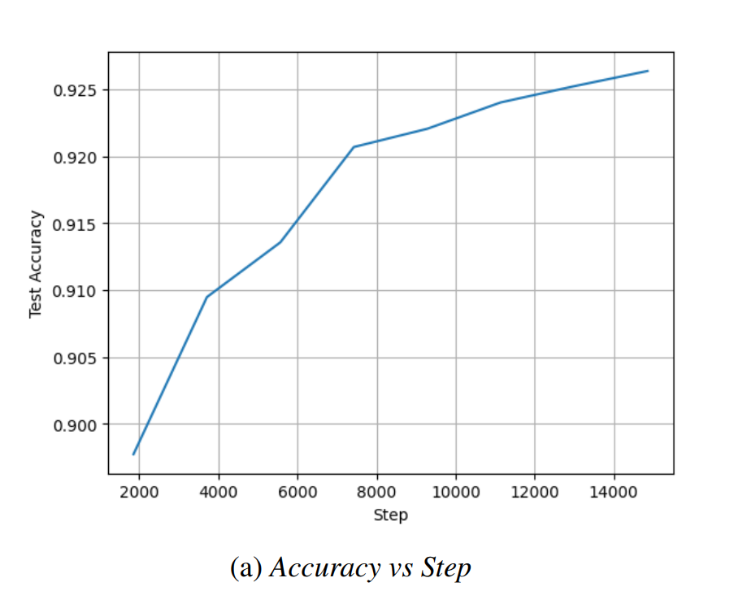
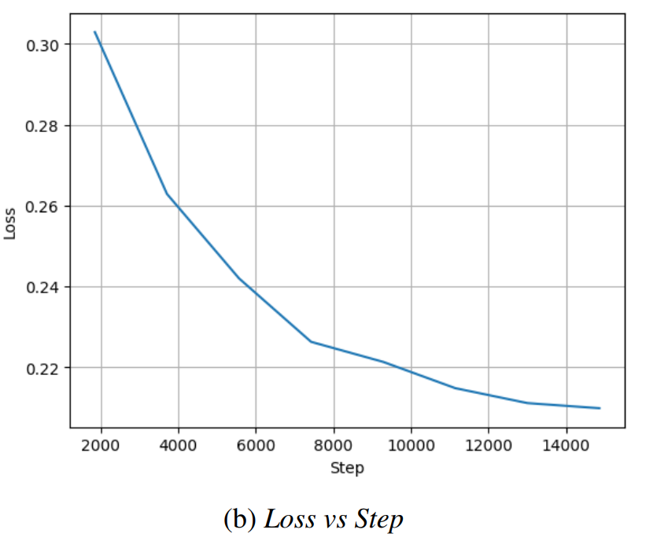

# News Classification with LoRA Fine-Tuning

**Deep Learning Project 2 – NYU Tandon, Spring 2025**  
Team members: *[Agustin Leon](https://github.com/aguleon), [Akhil Manoj](https://github.com/akM-2018), [Anup Raj Niroula] (https://github.com/ARNiroula)*  
🔗 [Project Repository](https://github.com/ARNiroula/news-data-llm-with-lora)  
🏆 **1st Place Winner** – [Kaggle Deep Learning Spring 2025 Project 2](https://www.kaggle.com/competitions/deep-learning-spring-2025-project-2)

---

## 🚀 Overview

This project explores parameter-efficient fine-tuning using **Low-Rank Adaptation (LoRA)** on a `RoBERTa-base` model for **text classification** on the AG-News dataset. The challenge required all fine-tuning to be done under **1 million trainable parameters**.

> 📈 Achieved:
> - **93.83%** Validation Accuracy  
> - **86.95%** Test Accuracy (Held-Out OOD Set)

---

## 🧪 Methodology

### 🏗️ Model Architecture

- Base model: `RoBERTa-base` (125M parameters)
- Fine-tuning via **LoRA**, using Hugging Face's `PEFT` library.
- Final model: **916,996 trainable parameters** (0.73% of total)

| **LoRA Param**      | **Value**                 |
|---------------------|---------------------------|
| `r` (Rank)          | 4                         |
| `lora_alpha`        | 64                        |
| `bias`              | all                       |
| `target_modules`    | ["query", "key", "value"] |
| `task_type`         | SEQ_CLS                   |

---

### ⚙️ Training Configuration

| **Training Arg**   | **Value**   |
|--------------------|-------------|
| Batch Size         | 64          |
| Learning Rate      | 2e-5        |
| Weight Decay       | 0.01        |
| Warmup Ratio       | 0.1         |

- Optimizer: `AdamW` and `FusedAdamW`
- Logging: TensorBoard
- Checkpointing: Default `TrainingArguments` settings

---

## 🧬 Data Augmentation

### ✅ Phase 1: Preprocessing + Synonym Replacement

- Removed HTML/escape characters
- Synonym-based replacement using **WordNet**
- Minor gains (~1-2%) observed

### 🧠 Phase 2: GPT-2 Based Domain Adaptation

1. **Fine-tuned GPT-2** for 2 epochs on the OOD unlabeled set.
2. **Prompt engineering** for all 4 AG-News classes.
3. Used Hugging Face's generator with:
   - Dynamic sample lengths (1–128)
   - Repetition penalty = 1.3
4. **12,000 synthetic samples** generated and appended to training data.

---

## 📉 Results

Our final LoRA-adapted RoBERTa model achieved strong results despite the strict constraint of having fewer than 1 million trainable parameters:

| **Metric**                  | **Value**       |
|----------------------------|-----------------|
| **Validation Accuracy**     | **93.83%**      |
| **Held-Out OOD Test Accuracy** | **86.95%**      |
| **Trainable Parameters**   | 916,996 (0.73%) |

### 📈 Training Dynamics

- Accuracy increased **rapidly** in the first few epochs, reaching ~91% by **epoch 3**.
- After that, accuracy improvements plateaued, gaining only ~1% over the next 7 epochs.
- The model showed signs of convergence around **epoch 11**, where training was stopped.

### 🔍 Observations

- Validation accuracy was consistently above **93%**, demonstrating excellent in-domain generalization.
- The **drop to 86.95%** on the out-of-distribution (OOD) test set reflected the domain gap.
  - This gap was **significantly reduced** by our GPT-2-based domain adaptation strategy.
  - Prior to augmentation, the OOD test accuracy was closer to **85%**.

### 📊 Training Curves

  
*Figure: Accuracy progression during training*

  
*Figure: Loss reduction over training steps*

---

## 🧾 Conclusions

- **LoRA** proved extremely effective for low-parameter fine-tuning.
- Best performance came from bold augmentation via **LLM-generated samples**.
- Future improvements could include:
  - More prompts per class
  - More diverse augmented data
  - Blending multiple augmentation strategies

---

## 🧰 Tools & Libraries

- 🤗 Hugging Face Transformers & PEFT
- 🧪 PyTorch
- 📊 TensorBoard
- 🧮 GPT-2 for data generation
- 📚 WordNet

---

## 📚 References

- [RoBERTa: Liu et al. (2019)](https://arxiv.org/abs/1907.11692)
- [PEFT Library (2022)](https://github.com/huggingface/peft)
- [AdamW Optimizer](https://arxiv.org/abs/1711.)
- [GPT-2 Prompt Tuning](https://arxiv.org/abs/2112.08718)
- [Synthetic Data with LLMs (2024)](https://arxiv.org/abs/2407.12813)

---

> *“Parameter-efficiency doesn't mean performance compromise. LoRA proves it.”*

---

### Note => Out best model is in the directory /87628_privateScore_files/best-model/
